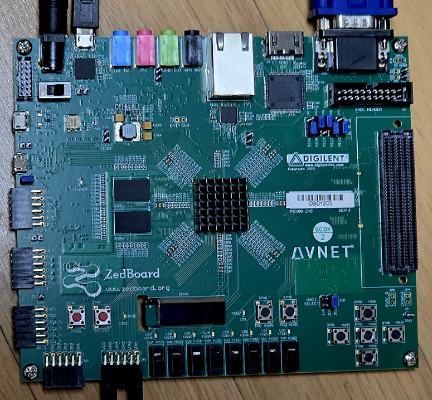
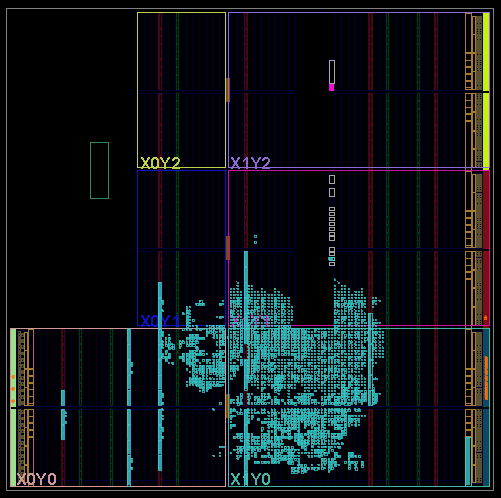
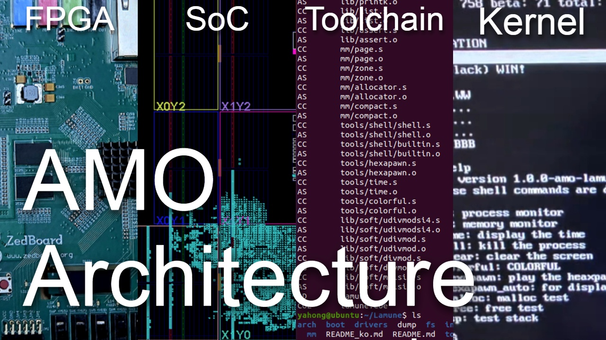

# Lamune-Amo

**32-bit RISC CPU (AMO)**, SoC, firmware, **toolchain**, and a **time-sharing kernel** — all running on real FPGA hardware.

`AMO` is a **from-scratch 32-bit RISC architecture**, fully designed and implemented in Verilog (PL-only, no PS).
`Lamune Amo` project covers the full stack:

- **Architecture** – hardwired 32-bit RISC CPU + SoC
- **Toolchain** – custom **binutils** and **GCC** ports
- **Firmware** – minimal ROM code (entry, memory init)
- **Kernel (Lamune)** – time-sharing OS with round-robin scheduler and shell
- **Document** – ISA, microarchitecture, memory map, and manuals

 
<table>
  <tr>
    <td></td>
    <td></td>
  </tr>
</table>

## Demo video

 

[Demo Video](https://www.youtube.com/watch?v=9i1m4zpB8fE)

## Repositories

| Repository | Role |
| ---------- | ---- |
| [**Architecture**](https://github.com/Lamune-Amo/Architecture) | AMO 32-bit RISC CPU & SoC in Verilog — hardwired control, unaligned 2-beat memory, PS/2, VGA, timer; FPGA-ready and capable of running a time-sharing system. |
| [**Lamune**](https://github.com/Lamune-Amo/Lamune)             | Time-sharing kernel for the AMO SoC — round-robin scheduler, IRQ/SWI, VGA/PS2 drivers, simple shell and demo utilities. |
| [**Firmware**](https://github.com/Lamune-Amo/Firmware)         | Minimal ROM-resident firmware — reset entry, memory initialization then jumps into the Lamune kernel. |
| [**Binutils**](https://github.com/Lamune-Amo/Binutils)         | AMO **binutils** port — complete ELF32 bare-metal toolchain for the AMO ISA (assembler, linker, objdump, ...). |
| [**GCC**](https://github.com/Lamune-Amo/GCC)                   | AMO **GCC** port — C compiler targeting `AMO`, aligned with the custom ABI and calling convention. |
| [**Document**](https://github.com/Lamune-Amo/Document)         | Documentation for AMO & Lamune — ISA spec, microarchitecture, memory map, control signals, and design notes. |
